# Project1

## Colorizing the Prokudin-Gorskii Photo Collection

### Single-scale Version (for Small Images)

I use the L2 norm metric and search over a window of [-15, 15] to align the G and R channels to the B channel. Also, I crop the image by 10% on each side at the begining for better alignment.

Below are the results for all `.jpg` images:

<table>
  <tr>
    <td align="center">
       
      <b>Cathedral</b>
    </td>
    <td align="center">
      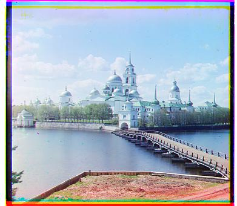 
      <b>Monastery</b>
    </td>
    <td align="center">
      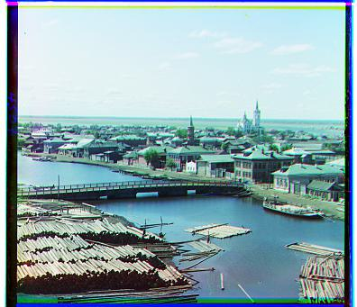 
      <b>Tobolsk</b>
    </td>
  </tr>
</table>

### Multi-scale Version (for All Images)

I continue using the L2 norm metric and add a coarse-to-fine pyramid to speed up processing for large images like `.tif` images.

Below are the results for all images:

<table>
  <tr>
    <td align="center">
       
      <b>Cathedral</b>
    </td>
    <td align="center">
       
      <b>Monastery</b>
    </td>
    <td align="center">
       
      <b>Tobolsk</b>
    </td>
  </tr>
  <tr>
    <td align="center">
      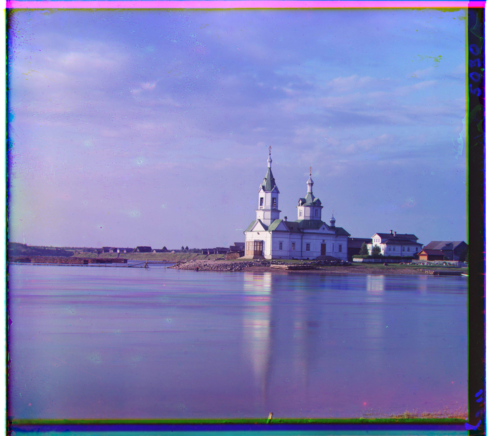 
      <b>Church</b>
    </td>
    <td align="center">
      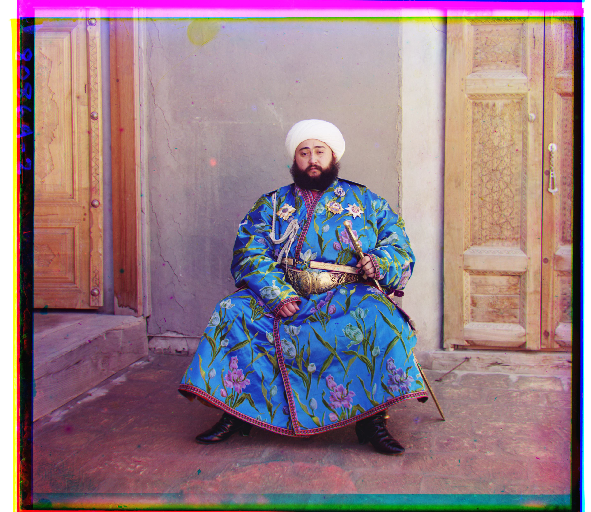 
      <b>Emir</b>
    </td>
    <td align="center">
      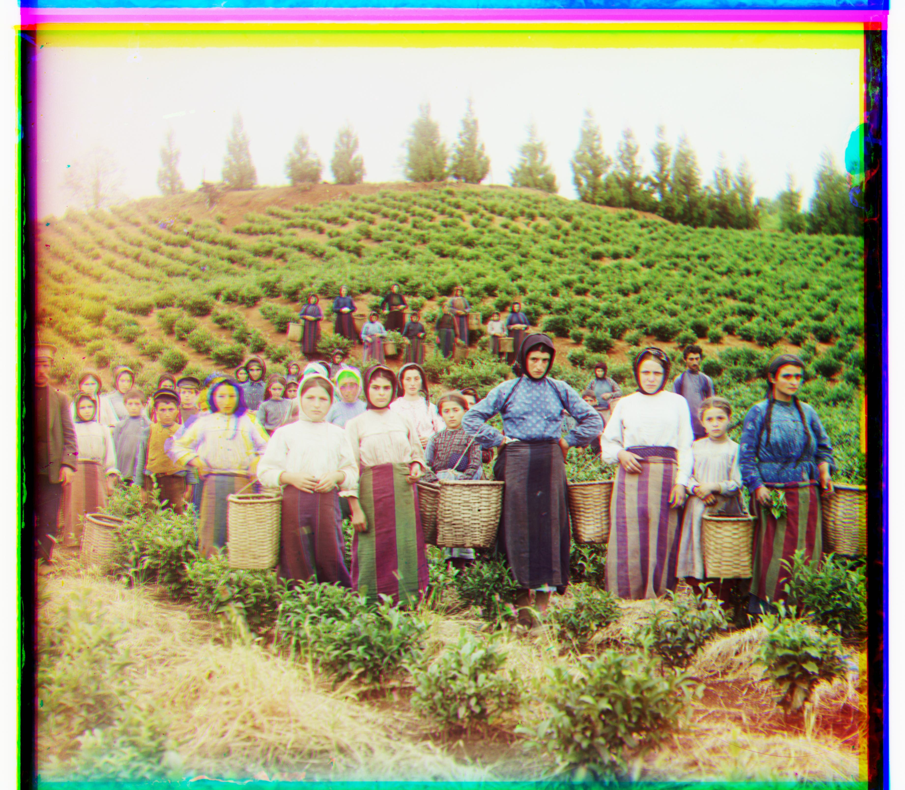 
      <b>Harvesters</b>
    </td>
  </tr>
  <tr>
    <td align="center">
      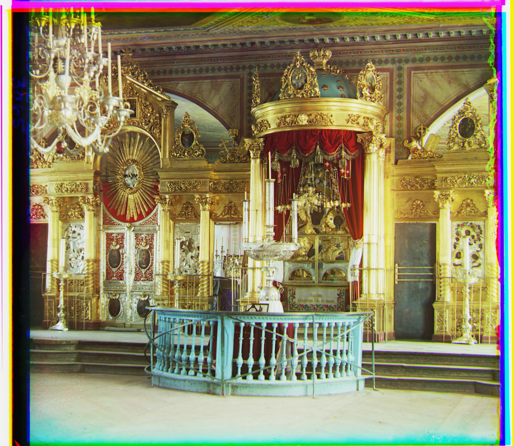 
      <b>Icon</b>
    </td>
    <td align="center">
      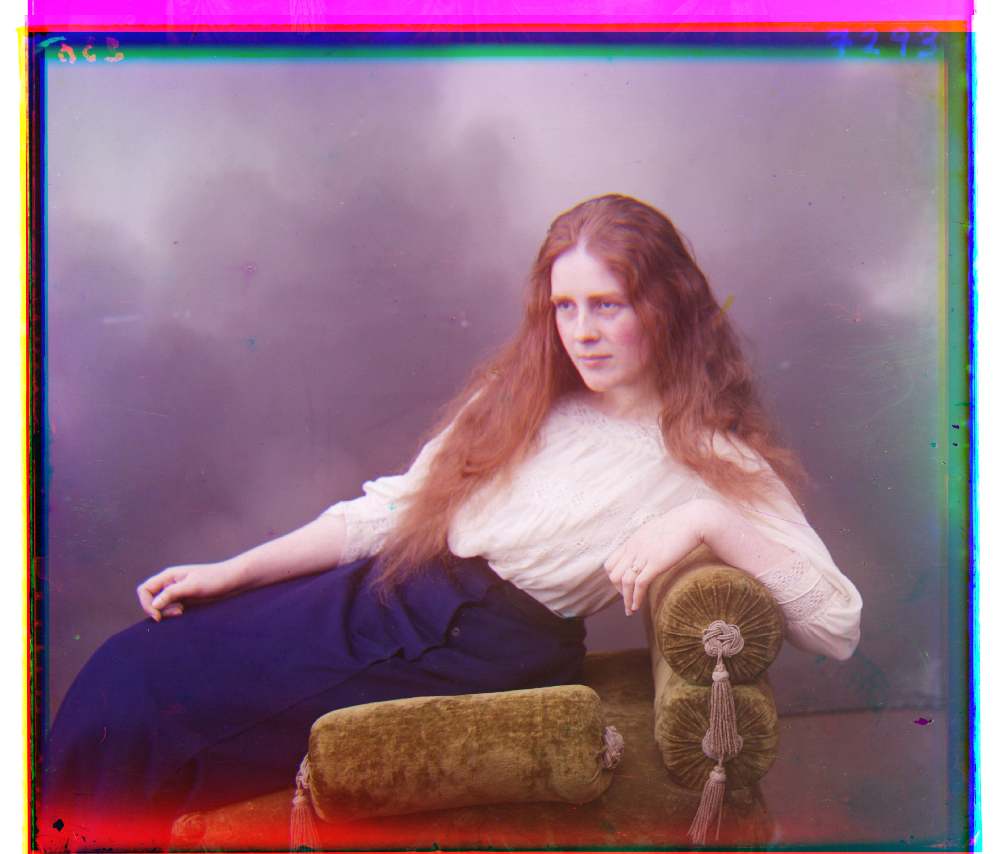 
      <b>Lady</b>
    </td>
    <td align="center">
       
      <b>Melons</b>
    </td>
  </tr>
  <tr>
    <td align="center">
       
      <b>Onion Church</b>
    </td>
    <td align="center">
      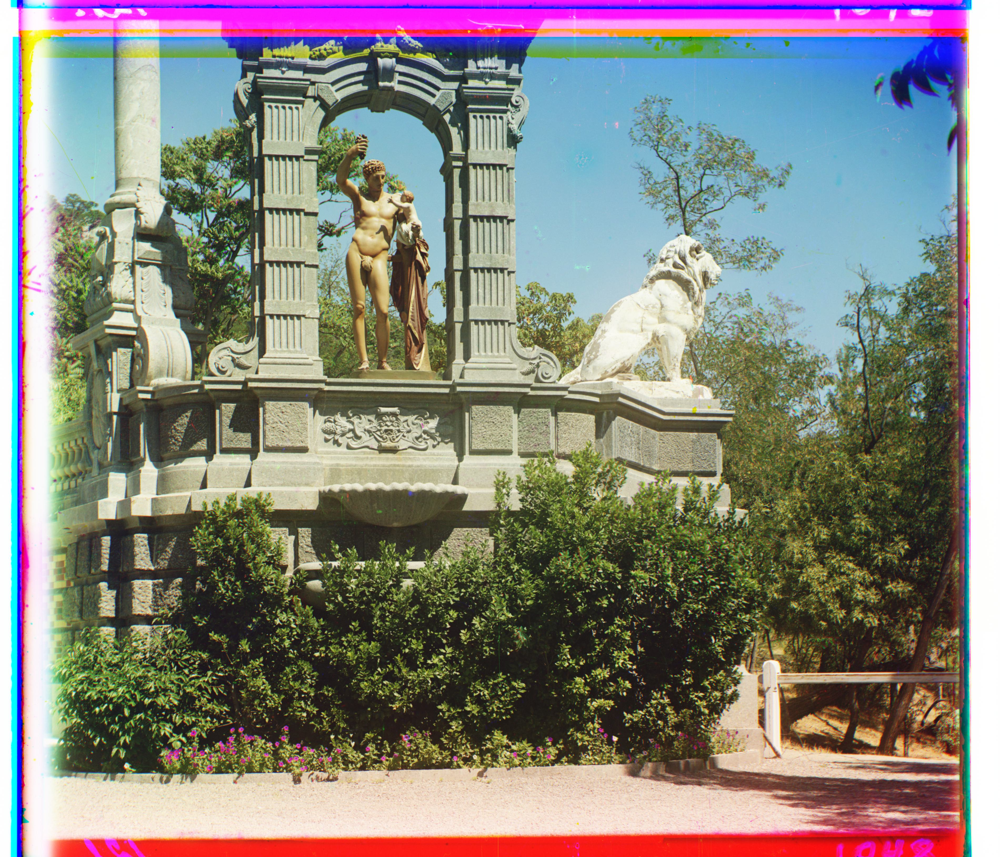 
      <b>Sculpture</b>
    </td>
    <td align="center">
      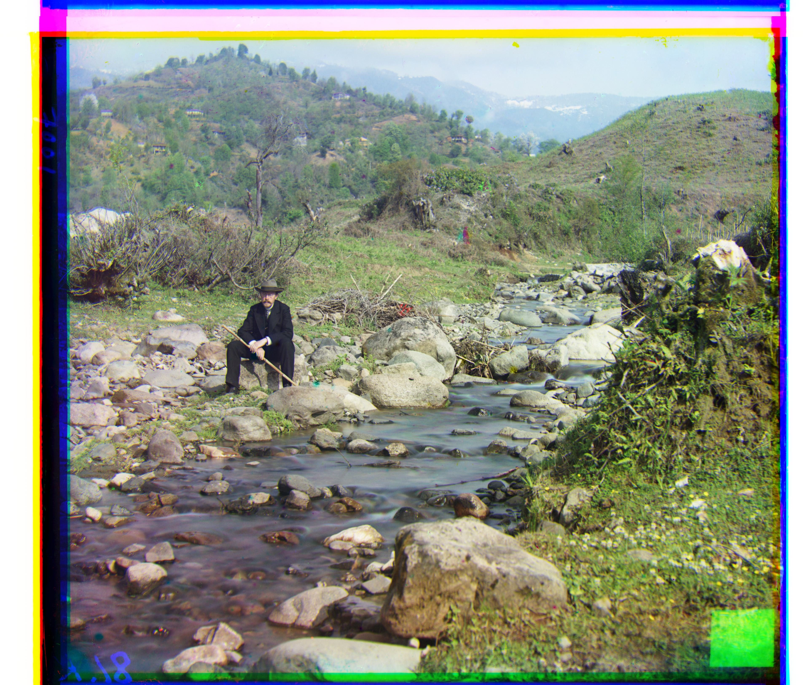 
      <b>Self Portrait</b>
    </td>
  </tr>
  <tr>
    <td align="center">
      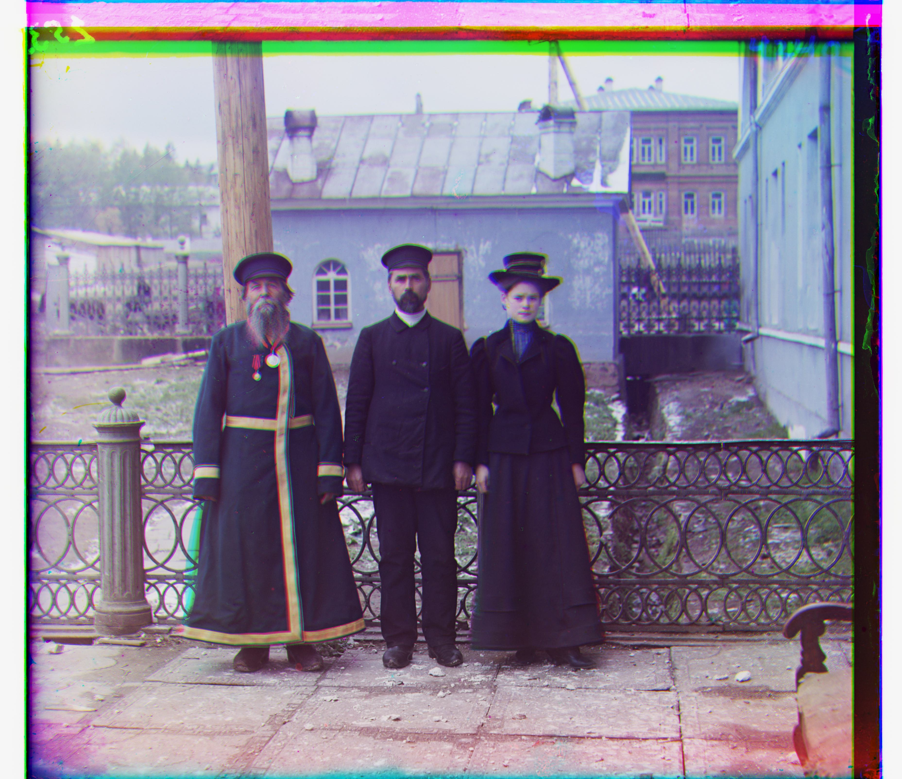 
      <b>Three Generations</b>
    </td>
    <td align="center">
      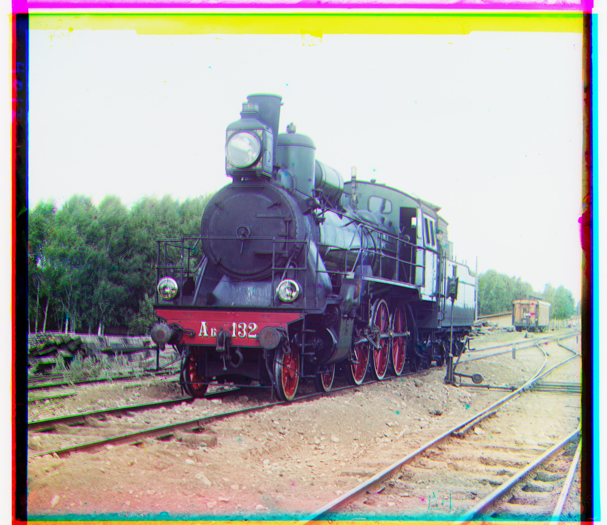 
      <b>Train</b>
    </td>
    <!-- Add more images here if needed -->
  </tr>
</table>
