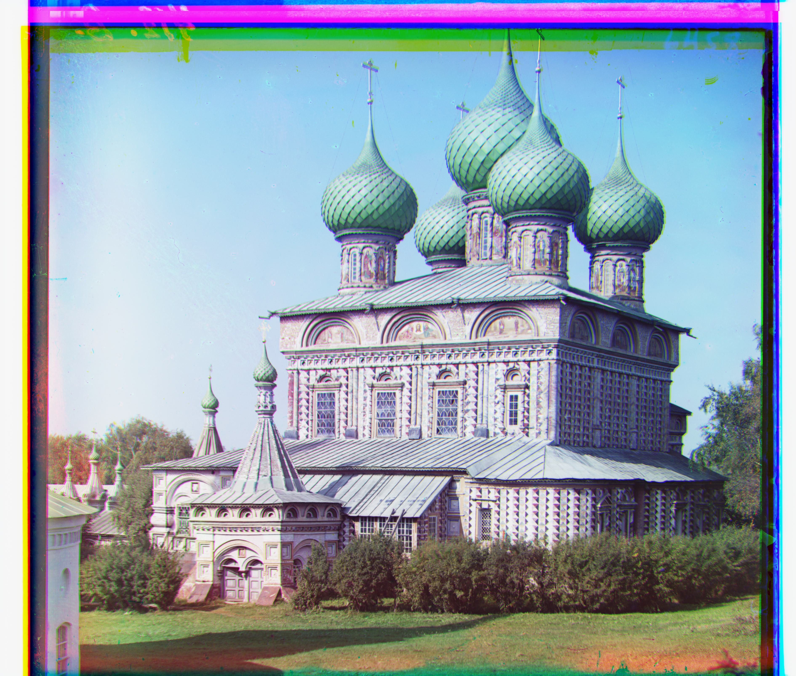

# Project1

## Colorizing the Prokudin-Gorskii photo collection

### single-scale version (for small image)
I use the L2 norm metric and search over a window of [-15, 15] to align the G and R channels to the B channel. Also I crop the image off for 10% on each side for a better alignment.

Below are the results for all .jpg image.

### multi-scale version (for all image)
I keep using the L2 norm metric, and add a coarse-to-fine pyramid to speed up when processing large image like .tif image.

Below are the results for all .jpg image.

