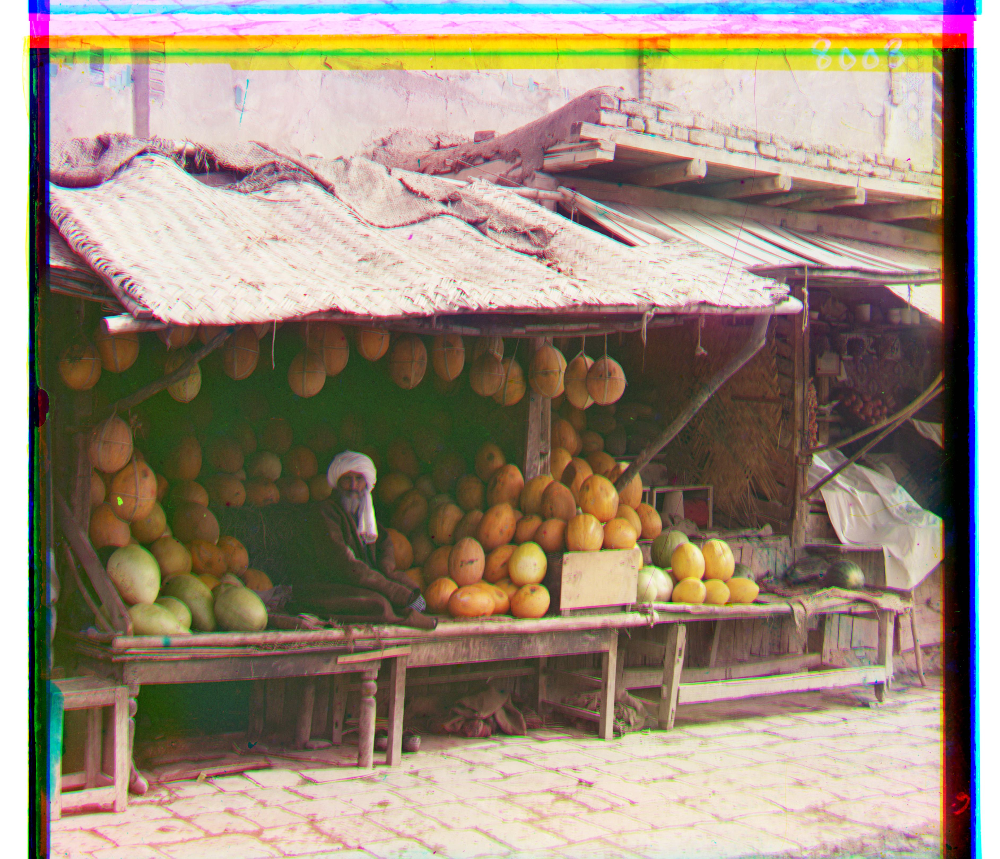

# Project1

## Colorizing the Prokudin-Gorskii photo collection

### Single-scale version (for small image)

I use the L2 norm metric and search over a window of [-15, 15] to align the G and R channels to the B channel. Also, I crop the image by 10% on each side for a better alignment.

Below are the results for all `.jpg` images.

  

    
  

  

    
  

  

    
  

### Multi-scale version (for all images)

I keep using the L2 norm metric and add a coarse-to-fine pyramid to speed up processing for large images like `.tif` images.

Below are the results for all `.tif` and `.jpg` images.

  

    
  

  

    
  

  

    
  

  

    
  

  

    
  

  

    
  

  

    
  

  

    
  

  

    
  

  

    
  

  

    
  

  

    
  

  

    
  

  

    
  

