# Project 2: Fun with Filters and Frequencies

Zhiyao Wang

This portfolio covers the completion of Project 2 for CS180: Intro to Computer Vision and 
Computational Photography. The project focuses on applying various filtering 
techniques, working with image frequencies, and performing multi-resolution blending.

## Part 1: Fun with Filters

### 1.1 Finite Difference Operator

The **gradient magnitude** is used to measure the rate of intensity change in an image, 
which helps in detecting edges. It is computed by first calculating the partial derivatives 
of the image in the x and y directions. This is typically done using the **finite difference 
operators** ( G_x ) and ( G_y ).

* Computation Process:

    i. In this project, the image is convolved with a filter [1, -1] to compute the 
       gradient in the x-direction, denoted as ( G_x ).

    ii. Similarly, the gradient in the y-direction, ( G_y ), is computed by convolving the 
        image with [1, -1]^T (the transpose of the x-direction filter).

    iii. Once the gradients are computed, the **magnitude** of the gradient at each pixel 
         is calculated using the formula:

        [ G = \sqrt{G_x^2 + G_y^2} ]

This value represents the overall rate of intensity change at each pixel, which highlights 
edges or boundaries in the image. The higher the gradient magnitude, the sharper the 
transition in intensity. (see result image under 1.2)

### 1.2 Derivative of Gaussian (DoG) Filter

Then, we introduce a **Gaussian filter** to reduce noise in the image before calculating the 
gradient. The Gaussian filter is applied to smooth the image, which helps in producing 
less noisy gradients compared to using finite difference operators directly. First create a 
blurred version of the original image by convolving with a gaussian and repeat the 
procedure in the previous part.

**Result:**

 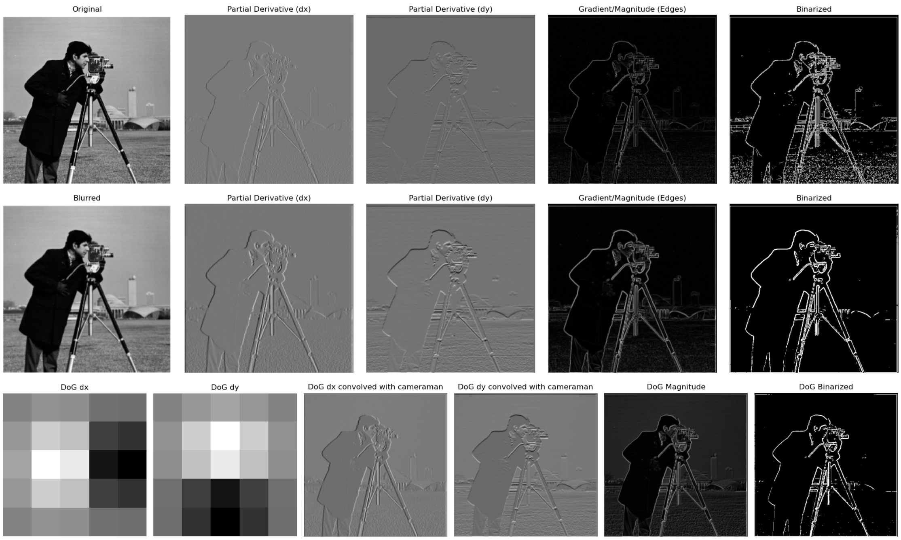

## Part 2: Fun with Frequencies

### 2.1 Image Sharpening

* Method:
  - First use Gaussian blur to obtain low frequencies of image.
  - Then, obtain high frequencies of image via "image - low".
  - Finally, add alpha times high frequencies back to image to obtain the sharpened 
    image.

* Formula:
  - Sharpened Image = Original Image + alpha * (Original Image - Blurred Image)

**Result:**

 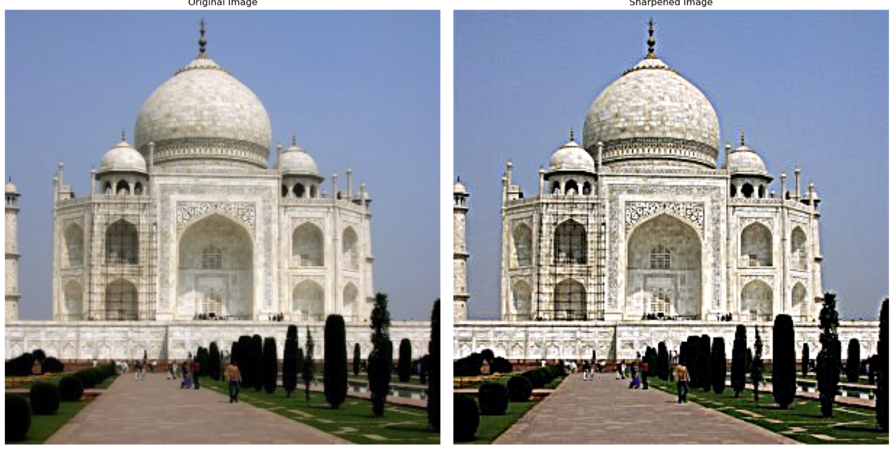
 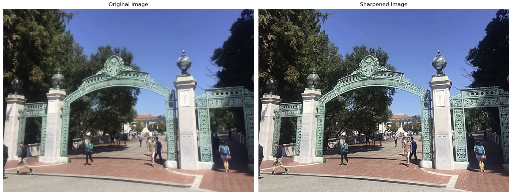
I also picked photo of the Sather Gate, blur it and then try to sharpen it again. However, 
resharpening after bluring the image didn't make the edge more clear, it's even more 
vague.
 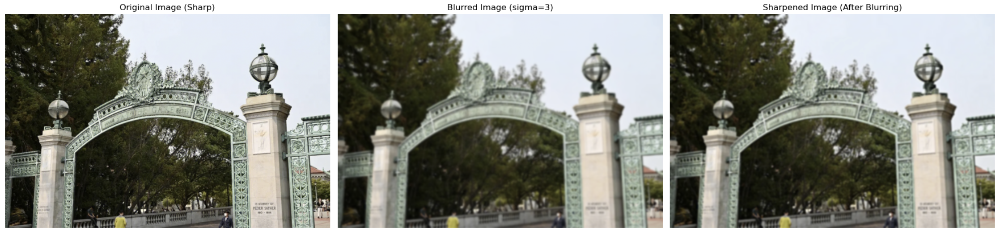

### 2.2 Hybrid Images

Hybrid images combine the high-frequency component of one image with the low-
frequency component of another, resulting in different interpretations based on viewing 
distance.

* Method:
  - A low-pass filter (Gaussian blur) was applied to one image, and a high-pass 
    filter was applied to the second image.
  - The two filtered images were combined to form the hybrid image.

* Fourier Analysis:
  - The Fourier transform was used to analyze the frequency components of both 
    the individual images and the hybrid result.

**Result:**

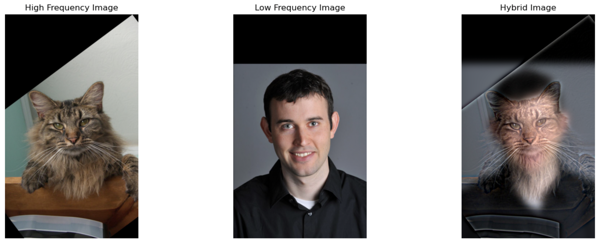
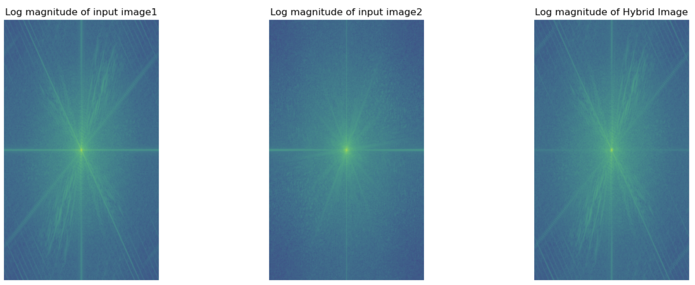
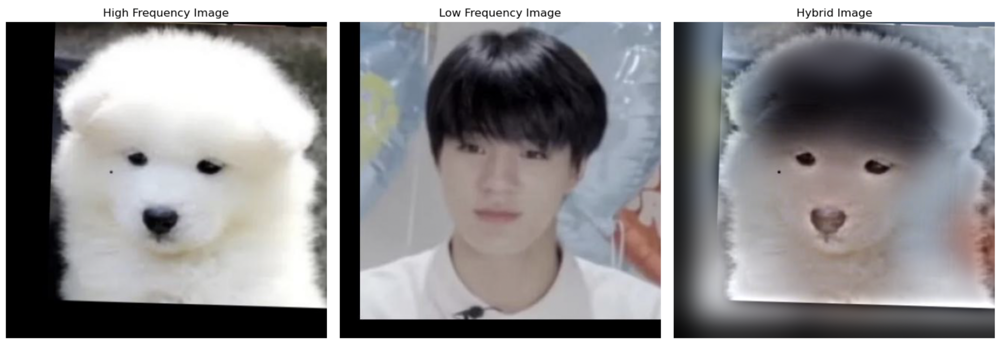
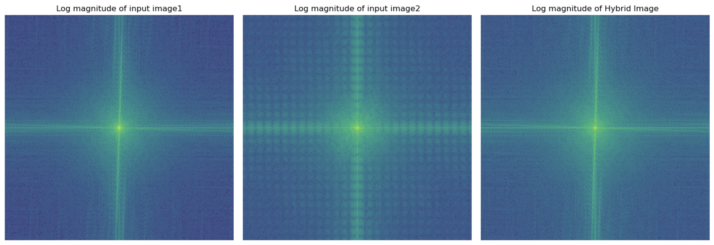
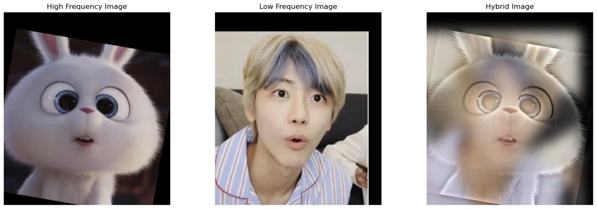
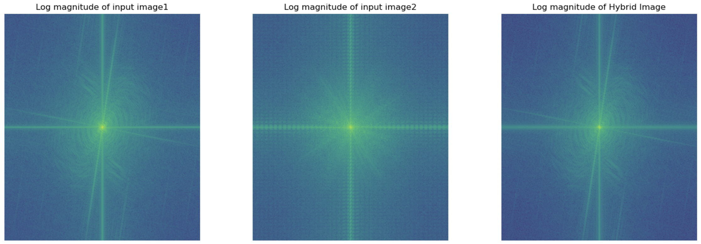

Since I aligned the image before hybrid, the result is pretty acceptable. From the fft 
image we can see that the hybrid image combinded the high-frequency and low-
frequency image very well, but it looks more similar to the high-frequency one.

### 2.3 Gaussian and Laplacian Stacks

Gaussian and Laplacian stacks were used to decompose images into frequency layers 
without downsampling. This prepares the images for multi-resolution blending.

* Method:
  - Successive layers of the Gaussian stack were created by applying increasingly 
    stronger Gaussian filters.
  - The Laplacian stack was created by subtracting each Gaussian layer from the 
    one above it.

**result:**

* Gaussian Stack

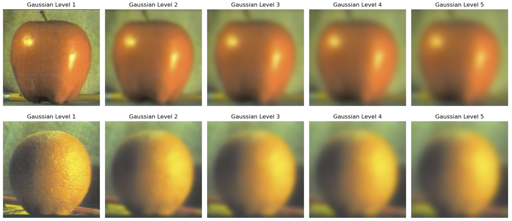

* Laplacian Stack

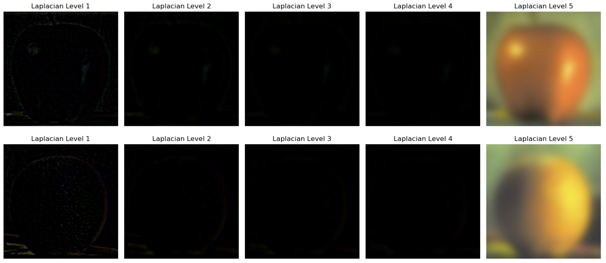

### 2.4 The Oraple Journey

Multi-resolution blending was applied to seamlessly merge images, such as the classical 
apple and orange combination. The Gaussian and Laplacian stacks of the two images 
were blended using a mask.

* Method:
  - A mask was used to blend corresponding layers of the Laplacian stacks of the 
    images.
  - The final image was reconstructed by adding the blended layers.

Oraple:

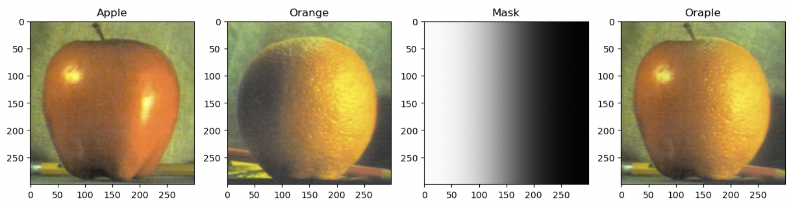

Jungwon22+23:

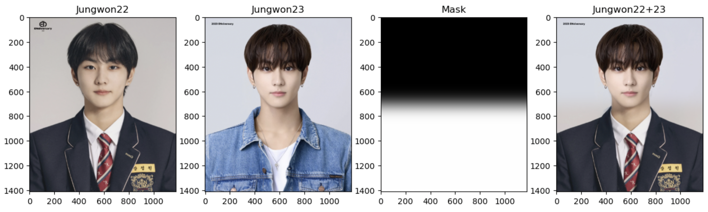

Jaywon:

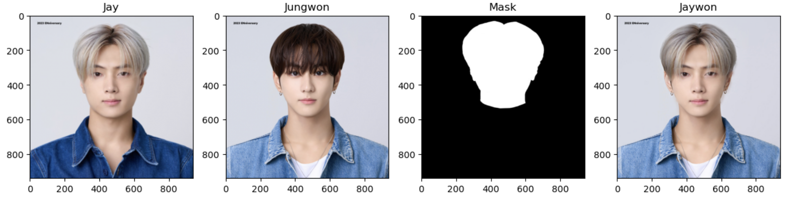
