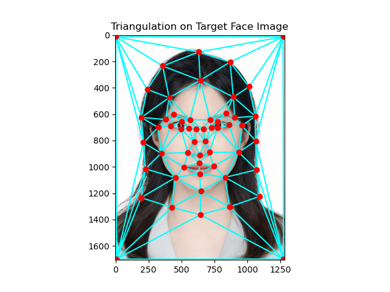

# Project: Face Morphing
Zhiyao Wang

This portfolio covers the completion of the Face Morphing Project for computational photography. The project focuses on using image processing techniques to morph between two faces, compute population averages, and generate caricatures.

---

## Part 1: Defining Correspondences

To morph between two faces, it is essential to define corresponding points on the facial features. I resized the two image to the same dimensions and then manually select points using ginput. Finally, the delaunay triangulation was generated at a midway shape.
Here, I chose to morph my face to my sister's face.

#### Results:

  
  

---

## Part 2: Computing the Mid-Way Face

To compute the mid-way face of two faces, there are three main steps:

1. **Compute the average shape**: For each pair of corresponding points in the two images, the average of their coordinates is computed.

2. **Warp both faces into the average shape**: The warping is done through affine transformations that map each triangle from the original image onto the corresponding triangle in the mid-way shape.
   
3. **averaging the colors together (Cross-dissolve)**: Once both faces are warped to the mid-way shape, the pixel values are averaged between the two warped images, resulting in the final mid-way face.

#### Results:

---

## Part 3: The Morph Sequence

Using Part 2 with a different fraction of warping and cross-dissolving (between [0, 1], where 0 is the original image and 1 is the target image), I got a morph sequence with 45 frames and duration of 30 fps.

#### Results:

  

---

## Part 4: The Mean Face of a Population

I used the FEI Face Database to compute the average face. This database consists 14 images for each of 200 individuals, a total of 2800 images. I used the 2 front face image for all 200 individuals, where one is a neutral face and the other is a smiling face. Each image contains 46 keypoints. I finally morphed these images into two average images: Neutral face and Smiling face.

#### Example:

  
  
  
  

  
  
  

#### Results:

  

I also warped my face into the average face's geometry and the average face to my face's geometry using the neutral average face. 

#### Results:

  

---

## Part 5: Caricatures: Extrapolating from the mean

Using the FEI Face database population means, I created caricatures of my face with a larger than normal alpha (alpha = 1.5).

#### Results:

  

---

## Bells and Whistles

I created a morphing GIF of my face at different ages.

  

