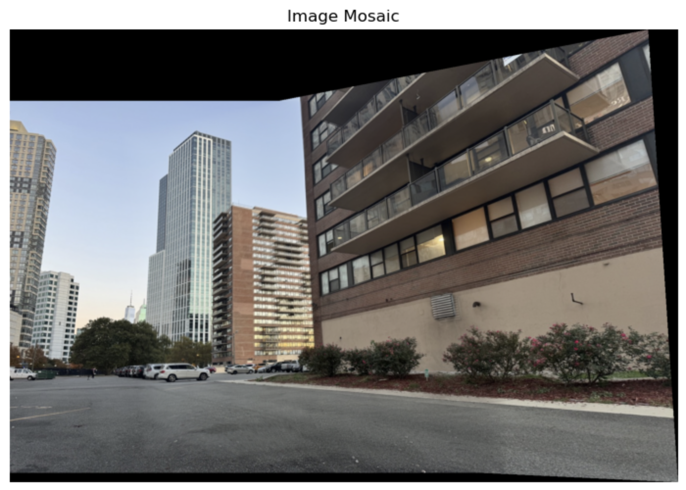
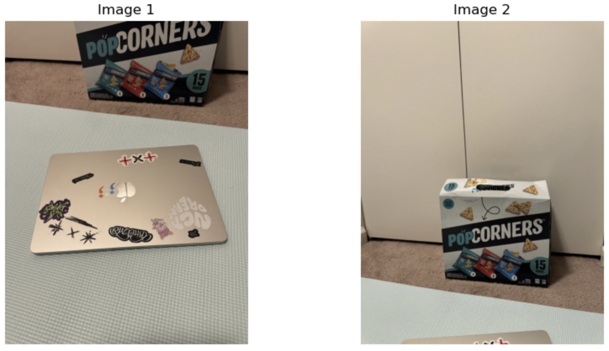
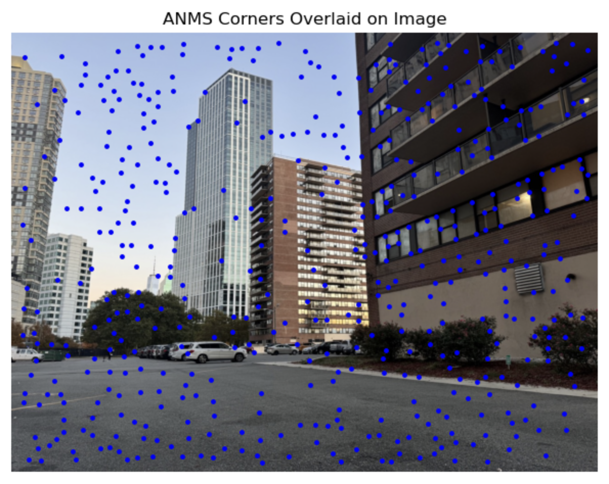

# Project 4A: Image Warping and Mosaicing
Zhiyao Wang

The project explores various aspects of image warping, including homography computation, image rectification, and the creation of  image mosaics through projective transformations and blending techniques.

---

## Part 1: Shoot the Pictures
Here is the picture I shoot and used in this project:

  
  
  
  

  
  
  
  

## Part 2: Recovering Homographies

To align multiple images into a single mosaic, it is crucial to determine the homographic transformations between them. A homography maps points from one image to another, enabling the warping and alignment necessary for mosaicing.

### Theory

  

  

For this system to not be underdetermined, we require at least 4 correspondences between the two images. Then we can solve for an approximate solution given an overconstrained system using least squares.

## Part 3: Warping the Images

To warp the images using the computed homography H, I used inverse warping. First, I transformed the four corners of the input image using H to determine the bounding box dimensions for the warped image. Then, I generated a grid of output coordinates within this bounding box and mapped these coordinates back to the input image using the inverse homography (H_inv). I tried to use scipy.interpolate.griddata first but it takes too long to process since my images are quite big. So I applied linear interpolation using the map_coordinates function from scipy.ndimage by looping over color channel.

## Part 4: Image Rectification

Using the four corner points of an object, I can perform image rectification now. 

### Results

## Part 5: Blend the images into a mosaic

I blended the images into a mosaic using a one-shot warping procedure. I leave image 1 unwarped and wraped image 2 into its projection using the homography matrix H which computed between corresponding points in image 1 and image 2. First, I determined the size of the final mosaic by transforming the corners of both images and calculating the necessary offsets to accommodate the warped images within the bounding box. I also created an alpha mask using distance transform to blend the two images together.

### Results

set 1:

  
  

set 2:

  
  

set 3:

  
  

---

# Project 4B: FEATURE MATCHING for AUTOSTITCHING

This project aims to create a system for automatically stitching images into a seamless mosaic.
The main steps involved in this project include:

1. Detecting corner features in an image.
2. Extracting a feature descriptor for each feature point.
3. Matching these feature descriptors between two images.
4. Computing a robust homography using RANSAC.
5. Creating a mosaic by stitching images using the computed homography.

---

## Detecting Corner Features

I started by detecting corner features using the Harris Interest Point Detector. The goal is to identify points that have distinct local intensity changes in multiple directions, making them ideal candidates for feature matching. Using the pre-implemented version of the Harris corner detector, I got the result shown below.

Result:

  
  

## Adaptive Non-Maximal Suppression (ANMS)

Then I implemented the ANMS method to reduce the number of potential keypoints by calculating the distance between every pair of points, and computing the suppresion radius for each feature, which is the distance to the nearest feature that's stronger. Then we sort and select the top n features. See the before/after ANMS comparison below.

Result:

  
  

## Extracting Feature Descriptors

extract 40x40 patches around each corner returned by ANMS, and then downsample to get 8x8 feature patches. After bias/gain normalization,
I extracted 40x40 patches around each point and then downsample and bias/gain-normalized to get 8x8 feature patches. See some samples of the 8x8 feature patches below.

Result:

  

## Feature Matching

The next step was to match the feature descriptors between two images. I used Lowe's ratio test to find pairs of features that look similar and are likely to be a good match. This was implemented by finding the two nearest neighbors in the feature descriptor space and keeping only those matches where the 1-NN/2-NN ratio was below a threshold. I got the matching result below.

Result:

  

Some matching patches:

  

## RANSAC

Now use the RANSAC algorithm to do further robustification. RANSAC was performed by randomly selecting four feature pairs, computing the homography, and retaining the homography with the largest set of inliers. So I can further filter out “outlier”. Below is the result after using RANSAC.  

Result:

  

## Final Results
set 1:

  
  
  The manual (left) and auto (right) mosaics.

set 2:

  
  

set 3:

  
  

---

## What I Learned

The coolest thing I learned from this project is automatically stitching images. I was surprised that only after a few steps, it can automatically select the matched points from a large image and stitch the image perfectly. This saves a huge amount of time compared to doing it manually.
