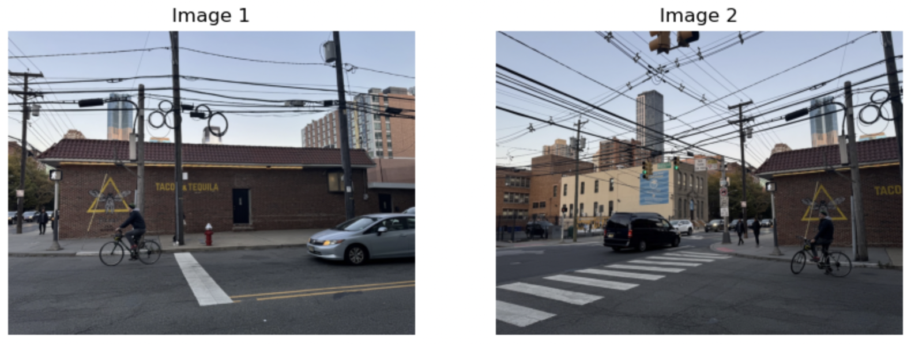
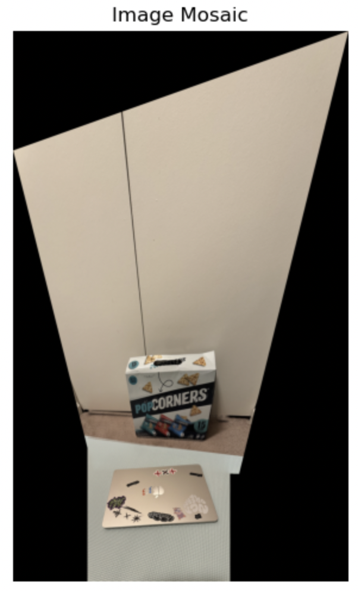

# Project: Image Warping and Mosaicing
Zhiyao Wang

The project explores various aspects of image warping, including homography computation, image rectification, and the creation of  image mosaics through projective transformations and blending techniques.

---

## Part 1: Shoot the Pictures
Here is the picture I shoot and used in this project:

  
  
  
  

  
  
  
  

---

## Part 2: Recovering Homographies

To align multiple images into a single mosaic, it is crucial to determine the homographic transformations between them. A homography maps points from one image to another, enabling the warping and alignment necessary for mosaicing.

### Theory

  

  

For this system to not be underdetermined, we require at least 4 correspondences between the two images. Then we can solve for an approximate solution given an overconstrained system using least squares.

---

## Part 3: Warping the Images

To warp the images using the computed homography H, I used inverse warping. First, I transformed the four corners of the input image using H to determine the bounding box dimensions for the warped image. Then, I generated a grid of output coordinates within this bounding box and mapped these coordinates back to the input image using the inverse homography (H_inv). I tried to use scipy.interpolate.griddata first but it takes too long to process since my images are quite big. So I applied linear interpolation using the map_coordinates function from scipy.ndimage by looping over color channel.

---

## Part 4: Image Rectification

Using the four corner points of an object, I can perform perform image rectification now. 

### Results

---

## Part 5: Blend the images into a mosaic

I blended the images into a mosaic using a one-shot warping procedure. I leave image 1 unwarped and wraped image 2 into its projection using the homography matrix H which computed between corresponding points in image 1 and image 2. First, I determined the size of the final mosaic by transforming the corners of both images and calculating the necessary offsets to accommodate the warped images within the bounding box. I also created an alpha mask that starts with a value of 1 at the center of each image and falls off linearly to 0 at the edges to blend the two images together.

### Results

set 1:

  
  

set 2:

  
  

set 3:

  
  

