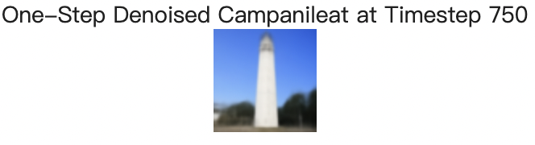

# Project 5: Fun With Diffusion Models!
Zhiyao Wang

The first part of the project explores the power of diffusion models, including the implementation of diffusion sampling loops, inpainting, iterative denoising, optical illusions, and image-to-image translation using pretrained models such as DeepFloyd IF. The second part of the project focuses on training a diffusion model from scratch using the MNIST dataset.

---

## Part A: The Power of Diffusion Models!

## Part 0: Setup
I use three text prompts -- “an oil painting of a snowy mountain village,” “a man wearing a hat,” and “a rocket ship” -- to generate images at three different numbers of inference steps: 20, 50, and 100. Here, the random seed I use is 180.

num_inference_steps = 20:

  

num_inference_steps = 50:

  

num_inference_steps = 100:

  

We can see that the quality of the outputs improves as the inference steps increase. There are more details in the picture generated which matches the prompt better with 100 inference steps.

## Part 1: Sampling Loops
### 1.1 Implementing the Forward Process
I implement the forward process for adding noise to a clean image, and generates noisy images of the Campanile at different levels (t=250, t=500, and t=750).

The forward process is defined by:

![Equation 1][(https://latex.codecogs.com/png.latex?q(x_t%20%7C%20x_0)%20%3D%20%5Cmathcal%7BN%7D%5Cleft(x_t%3B%20%5Csqrt%7B%5Cbar%7B%5Calpha%7D_t%7D%20x_0%2C%20(1%20-%20%5Cbar%7B%5Calpha%7D_t%29%20%5Cmathbf%7BI%7D%5Cright))]

which is equivalent to:

)

  

### 1.2 Classical Denoising
After generates noisy images of the Campanile at different levels (t=250, t=500, and t=750), I applies Gaussian blur filtering to each image to reduce the noise.

  
  

### 1.3 One-Step Denoising
For each noisy image, I use the UNet to denoise the image by estimating the noise. Besides, this diffusion model was trained with text conditioning, we also need a text prompt embedding. I use the prompt embedding "a high quality photo" to performs one-step denoising.

  
  
  

### 1.4 Iterative Denoising
I implement a denoising function to iteratively denoise images. We can skip steps to speed up the process. In our case, denoising is performed every 30 timesteps: starting from timestep 990 and progressing to 0.

### 1.5 Diffusion Model Sampling
- **Objective**: Generate images from scratch by denoising pure noise, using the iterative denoising function.
- **Deliverables**: Five sampled images of "a high quality photo".

### 1.6 Classifier-Free Guidance (CFG)
- **Objective**: Improve the quality of generated images using CFG. Images were generated for the prompt "a high quality photo" using a CFG scale of `7.5`.

---

## Part 2: Image-to-Image Translation and Inpainting
### 1.7 Image-to-Image Translation (SDEdit)
- **Objective**: Use the iterative denoising process to edit an existing image by adding noise and then denoising iteratively.
- **Deliverables**: Visualize the edits of the test image at various noise levels (`i_start = 1, 3, 5, 7, 10, 20`).

### 1.7.2 Inpainting
- **Objective**: Implement inpainting by running the diffusion denoising loop on masked regions of the image.
- **Deliverables**: Edited the top of the Campanile using a binary mask, as well as other selected images.

  

### 1.7.3 Text-Conditional Image-to-Image Translation
- **Objective**: Guide image editing with text prompts using SDEdit.

---

## Part 3: Visual Anagrams and Hybrid Images
### 1.8 Visual Anagrams
- **Objective**: Implement visual anagrams to create optical illusions using flipped image guidance.
- **Deliverables**: A visual anagram that displays "an oil painting of people around a campfire" when flipped, and "an oil painting of an old man" in the original orientation.

### 1.9 Hybrid Images
- **Objective**: Create hybrid images with diffusion models, where the generated image changes based on viewing distance.
- **Deliverables**: An image that looks like a `skull` from far away but a `waterfall` from close up.

---

# Project 5B: Training Your Own Diffusion Model
Zhiyao Wang

This part of the project focuses on training a diffusion model from scratch using the MNIST dataset.

---

## Part 1: Training a Single-Step Denoising UNet
### 1.1 Implementing the UNet
- **Objective**: Implement a UNet model with a downsampling and upsampling architecture.
- **UNet Architecture**: Consists of several convolutional layers and skip connections for denoising.

  

### 1.2 Using the UNet to Train a Denoiser
- **Objective**: Train a UNet to map noisy MNIST images back to clean versions.
- **Results**: Visualized denoised results on the test set at the end of the 1st and 5th epochs.

  
  

### 1.2.2 Out-of-Distribution Testing
- **Objective**: Evaluate the trained denoiser on noise levels it wasn't trained for.

---

## Part 2: Training a Diffusion Model
### 2.1 Adding Time Conditioning to UNet
- **Objective**: Condition the UNet on time step `t` to control the amount of noise during denoising.

### 2.2 Training the Time-Conditioned UNet
- **Objective**: Train the time-conditioned UNet to iteratively denoise images.
- **Results**: Visualized the loss curve over the training process and generated samples at different epochs.

### 2.3 Sampling from the UNet
- **Deliverables**: Visualized the generated results at different epochs (`1`, `5`, `10`, `15`, `20`).

  
  

### 2.4 Adding Class-Conditioning to UNet
- **Objective**: Condition the UNet on digit classes (0-9) using class-conditioned guidance for improved control.
- **Training Loss Curve**: Visualized the class-conditioned UNet training loss curve.

### 2.5 Sampling from the Class-Conditioned UNet
- **Objective**: Use classifier-free guidance with `w=7.5` to generate digit-specific images.
- **Deliverables**: Generated four instances of each digit at different epochs.

  

---

## What I Learned
This project provided a deep understanding of diffusion models, their power in generating images, and the nuances of training them from scratch. Implementing tasks such as visual anagrams and hybrid images were particularly interesting, as they demonstrated the creative potential of diffusion models.
