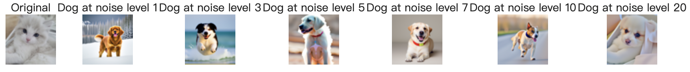
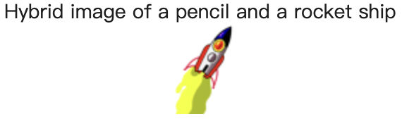
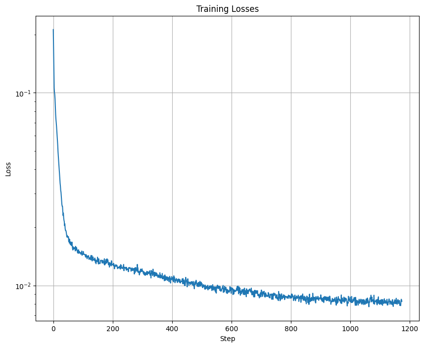

# Project 5: Fun With Diffusion Models!
Zhiyao Wang

The first part of the project explores the power of diffusion models, including the implementation of diffusion sampling loops, inpainting, iterative denoising, optical illusions, and image-to-image translation using pretrained models such as DeepFloyd IF. The second part of the project focuses on training a diffusion model from scratch using the MNIST dataset.

---

## Part A: The Power of Diffusion Models!

## Part 0: Setup
I use three text prompts -- “an oil painting of a snowy mountain village,” “a man wearing a hat,” and “a rocket ship” -- to generate images at three different numbers of inference steps: 20, 50, and 100. Here, the random seed I use is 180.

num_inference_steps = 20:

  

num_inference_steps = 50:

  

num_inference_steps = 100:

  

We can see that the quality of the outputs improves as the inference steps increase. There are more details in the picture generated which matches the prompt better with 100 inference steps.

## Part 1: Sampling Loops
### 1.1 Implementing the Forward Process
I implement the forward process for adding noise to a clean image, and generates noisy images of the Campanile at different levels (t=250, t=500, and t=750).

The forward process is defined by:

%20%3D%20%5Cmathcal%7BN%7D%5Cleft(x_t%3B%20%5Csqrt%7B%5Cbar%7B%5Calpha%7D_t%7D%20x_0%2C%20(1%20-%20%5Cbar%7B%5Calpha%7D_t%29%20%5Cmathbf%7BI%7D%5Cright)))

which is equivalent to:

)

  

### 1.2 Classical Denoising
After generates noisy images of the Campanile at different levels (t=250, t=500, and t=750), I applies Gaussian blur filtering to each image to reduce the noise.

  
  

### 1.3 One-Step Denoising
For each noisy image, I use the UNet to denoise the image by estimating the noise. Besides, this diffusion model was trained with text conditioning, we also need a text prompt embedding. I use the prompt embedding "a high quality photo" to performs one-step denoising.

  
  
  

### 1.4 Iterative Denoising
I implement a denoising function to iteratively denoise images using the formula:

%7D%7B1%20-%20%5Cbar%5Calpha_t%7D%20x_t%20%2B%20v_%5Csigma)

where t is the current step, and t' is next step.

We can skip steps to speed up the process. In our case, denoising is performed every 30 timesteps: starting from timestep 990 and progressing to 0.

  
  
  

  
  

Results of using different methods of denoising:

  

### 1.5 Diffusion Model Sampling
In part 1.4, we use the diffusion model to denoise an image. Another thing we can do with the iterative_denoise function is to generate images from scratch. We can do this by setting i_start = 0 and passing in random noise. This effectively denoises pure noise. Here are 5 results of "a high quality photo":

  

### 1.6 Classifier-Free Guidance (CFG)
To improve the quality of generated images, I implement the CFG (Classifier-Free Guidance) method. In CFG, we compute both a noise estimate conditioned on a text prompt, and an unconditional noise estimate. We denote these $\epsilon_c$ and $\epsilon_u$. Then, we let our new noise estimate be:

)

where $\gamma$ controls the strength of CFG. Notice that for $\gamma = 0$, we get an unconditional noise estimate, and for $\gamma = 1$ we get the conditional noise estimate. The magic happens when $\gamma > 1$. In this case, we get much higher quality images. Here are  5 images of "a high quality photo" with a CFG scale of $\gamma = 7$:

  

### 1.7 Image-to-Image Translation
Following the SDEdit algorithm, we add noise to an image and force it back onto the image manifold without any conditioning, then we will get an image that is similar to the test image. I apply this technique to the test image, with the text prompt "a high quality photo" at noise levels [1, 3, 5, 7, 10, 20].

Campanile:

  

Dog:

  

  

### 1.7.1 Editing Hand-Drawn and Web Images
This procedure works particularly well if we start with a nonrealistic image and project it onto the natural image manifold. I use both web image and hand drawn images with the text prompt "a high quality photo" at noise levels [1, 3, 5, 7, 10, 20, 30].

web image:

  
  

hand drawn:

  
  

  
  

### 1.7.2 Inpainting
We can use the same procedure to implement inpainting following the RePaint paper. Given an image $x_{orig}$, and a binary mask $\mathbf{m}$, we can create a new image that has the same content where $\mathbf{m}$ is 0, but new content wherever $\mathbf{m}$ is 1. Run the diffusion denoising loop, but at every step, after obtaining $x_t$, we "force" $x_t$ to have the same pixels as $x_{orig}$ where $\mathbf{m}$ is 0:

%20%5Ctext%7Bforward%7D(x_%7Borig%7D%2C%20t))

Results:

Inpaint the top of the Campanile:

  
  

Inpaint the face of the dog:

  
  

Inpaint the top of the tower:

  
  

### 1.7.3 Text-Conditioned Image-to-image Translation
In this part, we will guide the projection with a text prompt. I change the prompt from "a high quality photo" to one of the precomputed prompts.

Campanile with prompt: a rocket ship

  

Cat with prompt: a photo of a dog

  

A person with prompt: a photo of a dog

  

### 1.8 Visual Anagrams
In this part, we will implement Visual Anagrams and create optical illusions with diffusion models. We will create an image that looks like prompt 1, but when flipped upside down will reveal prompt 2.

To do this, we will denoise an image $x_t$ at step $t$ normally with the prompt 1, to obtain noise estimate $\epsilon_1$. But at the same time, we will flip $x_t$ upside down, and denoise with the prompt 2, to get noise estimate $\epsilon_2$. We can flip $\epsilon_2$ back, to make it right-side up, and average the two noise estimates. We can then perform a reverse diffusion step with the averaged noise estimate.

Algorithms:

)

%2C%20t%2C%20p_2)))

%20%2F%202)

where UNet is the diffusion model UNet from before, $\text{flip}(\cdot)$ is a function that flips the image, and $p_1$ and $p_2$ are two different text prompt embeddings. And our final noise estimate is $\epsilon$.

Prompt 1: An oil painting of people around a campfire

Prompt 2: An oil painting of an old man

  

  

Prompt 1: A lithograph of waterfalls

Prompt 2: A lithograph of a skull

  

Prompt 1: An oil painting of people around a campfire

Prompt 2: An oil painting of a snowy mountain village

  

### 1.9 Hybrid Images
In this part, we will create hybrid images with diffusion models, where the generated image changes based on viewing distance.

Create a composite noise estimate $\epsilon$ by estimating the noise with two different text prompts. Then combine low frequencies from one noise estimate with high frequencies of the other. Algorithms:

)

)

%20%2B%20f_%5Ctext%7Bhighpass%7D(%5Cepsilon_2))

where UNet is the diffusion model UNet, $f_\text{lowpass}$ is a low pass function, $f_\text{highpass}$ is a high pass function, and $p_1$ and $p_2$ are two different text prompt embeddings. Our final noise estimate is $\epsilon$.

Prompt 1: A lithograph of a skull

Prompt 2: A lithograph of waterfalls

  

Prompt 1: A pencil

Prompt 2: A rocket ship

  

Prompt 1: A man wearing a hat

Prompt 2: A lithograph of waterfalls

  

---

## Part B: Diffusion Models from Scratch!

## Part 1: Training a Single-Step Denoising UNet
First, implement a simple one-step denoiser:

%20-%20x%20%5Cright%5C%7C%5E2)

where $z$ = noisy image, $x$ = original image, $D_{\theta}(z)$ = denoised image.

### 1.1 Implementing the UNet
First, implement the UNet architecture:

  

And the UNet operations:

  

### 1.2 Using the UNet to Train a Denoiser
To use the UNet to train the denoiser, we need to generate training data pairs of $(z, x)$, where each $x$ is a clean MNIST digit. For each training batch, we can generate $z$ from $x$ using the following noising process:

)

Here is a visualization of the noising process using $\sigma = [0.0, 0.2, 0.4, 0.5, 0.6, 0.8, 1.0]$.

  

### 1.2.1 Training
Now it's time to train the model!

#### Parameters:

Batch size: 256

Number of epochs: 5

Optimizer: Adam with learning rate of 1e-4

Hidden Dimensions = 128

#### Traning loss curve:

  

### 1.2.2 Out-of-Distribution Testing
- **Objective**: Evaluate the trained denoiser on noise levels it wasn't trained for.

---

## Part 2: Training a Diffusion Model
### 2.1 Adding Time Conditioning to UNet
- **Objective**: Condition the UNet on time step `t` to control the amount of noise during denoising.

### 2.2 Training the Time-Conditioned UNet
- **Objective**: Train the time-conditioned UNet to iteratively denoise images.
- **Results**: Visualized the loss curve over the training process and generated samples at different epochs.

### 2.3 Sampling from the UNet
- **Deliverables**: Visualized the generated results at different epochs (`1`, `5`, `10`, `15`, `20`).

  
  

### 2.4 Adding Class-Conditioning to UNet
- **Objective**: Condition the UNet on digit classes (0-9) using class-conditioned guidance for improved control.
- **Training Loss Curve**: Visualized the class-conditioned UNet training loss curve.

### 2.5 Sampling from the Class-Conditioned UNet
- **Objective**: Use classifier-free guidance with `w=7.5` to generate digit-specific images.
- **Deliverables**: Generated four instances of each digit at different epochs.

  

---

## What I Learned
This project provided a deep understanding of diffusion models, their power in generating images, and the nuances of training them from scratch. Implementing tasks such as visual anagrams and hybrid images were particularly interesting, as they demonstrated the creative potential of diffusion models.
